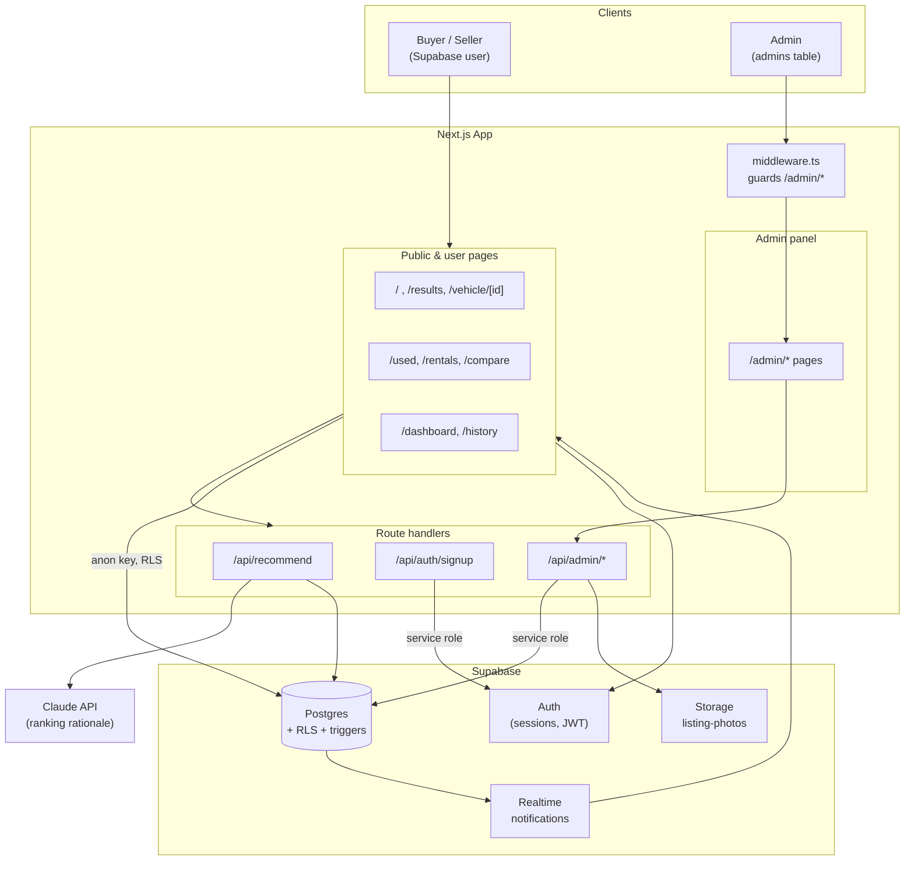
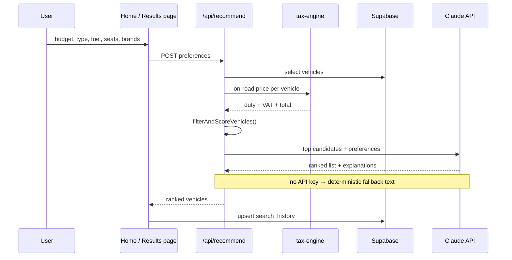
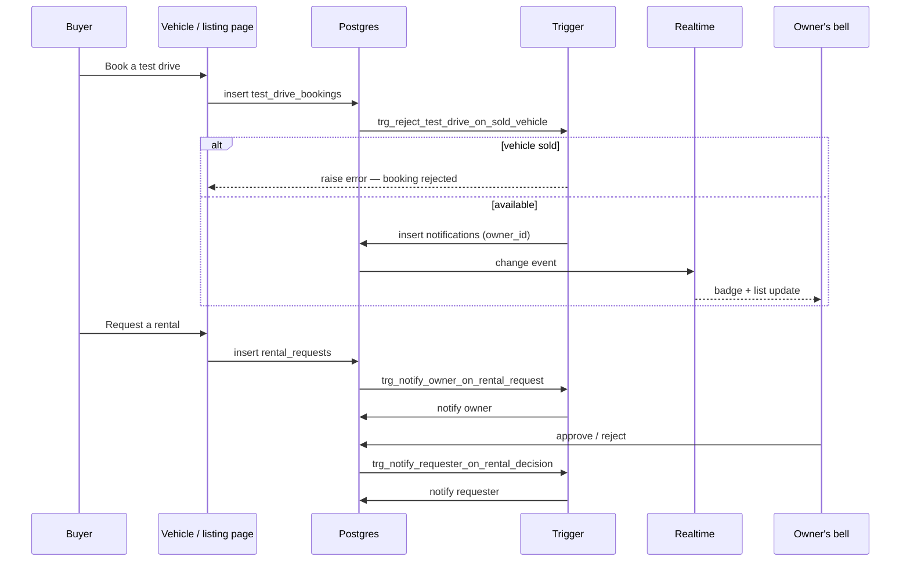
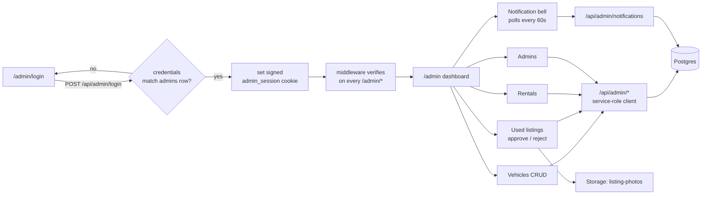
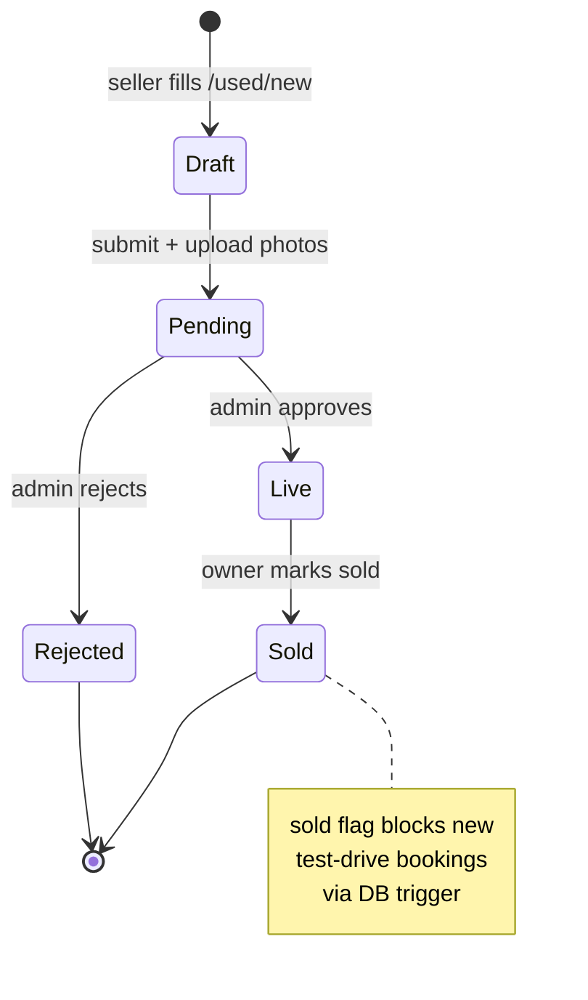

# System Workflow Diagram

Vehicle showroom platform — Next.js (App Router) + Supabase (Postgres, Auth, Storage, Realtime) + Claude API.

## 1. High-level architecture

**Two independent auth systems.** Users authenticate through Supabase Auth and read/write under RLS with the anon key. Admins authenticate against an `admins` table, receive a signed `admin_session` cookie (`lib/admin-session.ts`, HMAC via Web Crypto so it runs on the edge), and their API routes use the service-role key to bypass RLS.

## 2. Recommendation flow

Budget filtering happens on the **on-road** price, not the ex-showroom price — `lib/tax-engine.ts` applies Nepal customs/excise/VAT before the budget constraint is tested.

## 3. Test drive & rental notifications

Notifications are never written by the client. Postgres triggers own that, so RLS can keep `notifications` read-only (plus mark-read) for the recipient.

## 4. Admin workflow

The admin bell **polls** (`AdminNotificationBell`, 60s) rather than using Realtime, because admins are not Supabase users and have no JWT for a realtime channel.

## 5. Used-listing lifecycle

